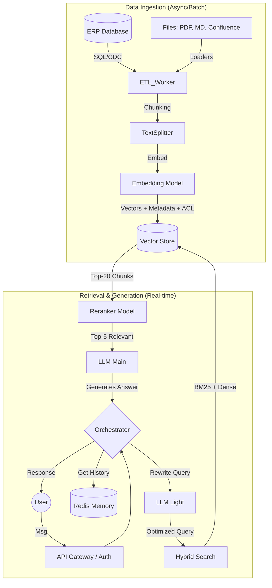

# Техническое решение: RAG-система для ERP

## 1. Цель
Создание интеллектуального ассистента, способного:
*   Отвечать на вопросы сотрудников на основе документации ERP
*   Предоставлять актуальную информацию из бизнес-данных
*   Автоматизировать рутинные запросы
*   Ускорить onboarding новых сотрудников

## 2. Область действия
*   Разработка и развертывание RAG-системы
*   Интеграция с существующей ERP-системой
*   Создание интерфейсов доступа (Telegram, веб, API)

## 3. Общие требования

### 3.1. Функциональные требования
| ID | Требование | Приоритет | Описание |
|:---|:---|:---|:---|
| **FR-001** | Поиск в документации | Высокий | Система должна искать информацию в технической документации ERP |
| **FR-002** | Ответы на основе данных | Высокий | Генерация ответов с использованием актуальных бизнес-данных |
| **FR-003** | Многоязычная поддержка | Средний | Поддержка русского и английского языков |
| **FR-004** | Контекстный диалог | Высокий | Учет истории разговора в пределах сессии |
| **FR-005** | Цитирование источников | Высокий | Указание источников информации в ответах |

### 3.2. Нефункциональные требования
| Параметр | Требование | Метрика |
|:---|:---|:---|
| Производительность | Время ответа | < 3 секунд (P95) |
| Доступность | Uptime | 99.5% в рабочее время |
| Масштабируемость | Пользователи | До 1000 concurrent |
| Точность | Релевантность ответов | > 85% |
| Безопасность | Аудит | Логирование всех запросов |

---

## 4. Архитектурные требования

### 4.1. Высокоуровневая архитектура

Система построена по архитектуре **Advanced RAG** с разделением на контур подготовки данных (Ingestion) и контур обработки запросов (Retrieval).

### 4.2. Компоненты системы

| Компонент | Технология | Обоснование выбора |
|-----------|------------|--------------------|
| **Orchestrator** | **LangChain / LangGraph** | Управление логикой RAG, историей диалогов и цепочками вызовов. |
| **API Gateway** | **FastAPI** | Высокопроизводительный асинхронный фреймворк для реализации REST API. |
| **Vector Store** | **Qdrant** | Оптимален для ERP благодаря поддержке **Hybrid Search** (Вектор + Ключевые слова) и быстрой фильтрации по метаданным (RBAC). |
| **LLM Inference** | **vLLM** | Сервер инференса с поддержкой PagedAttention. Критически важен для утилизации GPU и скорости < 3 сек. |
| **Session Storage** | **Redis** | Хранение истории чатов (Context Window) и кэширование частых запросов. |
| **ETL Pipeline** | **Apache Airflow** | Оркестрация обновлений данных. Поддержка расписаний и мониторинг ошибок загрузки из ERP. |
| **Observability** | **LangFuse** | Трейсинг запросов, оценка качества (LLM-as-a-Judge) и сбор датасетов. |

---

## 5. Технические требования

### 5.1. Выбор моделей (Анализ и Заключение)

**Заключение по таблице из ТЗ:**
Предложенный стек моделей **функционален**, но имеет **критические риски по ресурсам (VRAM)** и **устаревшие компоненты (Embeddings)**. Ниже приведен детальный анализ и рекомендации по исправлению.

| Компонент | Модель из ТЗ | Анализ (Что хорошо / Что плохо) | Рекомендация по исправлению |
|-----------|--------------|---------------------------------|-----------------------------|
| **Эмбеддинги** | `paraphrase-multilingual-MiniLM-L12-v2` | **Плохо:** Модель устарела (2021 г.). Лимит 512 токенов критичен для документации. Качество русского языка среднее. | Заменить на **`intfloat/multilingual-e5-large`** или **`BAAI/bge-m3`** (до 8192 токенов, SOTA качество). Ресурсов хватит. |
| **LLM (Основная)** | `Qwen2.5-14B-Instruct` | **Критично:** В формате FP16 модель весит ~28 ГБ. **Она не влезет в карту 24 ГБ VRAM** (будет OOM ошибка). | Обязательно использовать **квантование (AWQ/GPTQ Int4)**. Вес упадет до ~10-12 ГБ, качество сохранится, останется место под контекст. |
| **LLM (Легкая)** | `Qwen2.5-3B-Instruct` | **Рискованно:** Запуск на CPU (8 ядер) даст скорость 5-10 токенов/сек. Это ставит под угрозу SLA < 3 сек. | Использовать GPU (даже слабую) или оптимизированный рантайм **llama.cpp** (GGUF формат). |
| **Ранжирование** | `BAAI/bge-reranker-v2-m3` | **Хорошо:** Отличный выбор. Мультиязычная, поддерживает длинный контекст. | Оставить без изменений. |

### 5.2. Векторная база данных

**Критерии выбора:**
1.  **Hybrid Search (Гибридный поиск):** Обязательное наличие поиска по ключевым словам (BM25) в сочетании с вектором. *Обоснование:* В ERP часто ищут точные совпадения (артикул, ID заказа, фамилия), векторный поиск тут может ошибаться.
2.  **Filtering & Security (RBAC):** Эффективная пре-фильтрация (Pre-filtering) метаданных. *Обоснование:* Разграничение прав доступа. Сотрудник склада не должен находить в поиске зарплатные ведомости.
3.  **Performance:** Latency < 50мс на поиск (P95) при нагрузке.
4.  **Self-hosted:** Возможность развертывания on-premise (Docker/K8s) для безопасности данных.

**Кандидаты:**
*   **Qdrant (Рекомендован):** Написан на Rust, нативно поддерживает Hybrid Search, очень быстрый, удобная фильтрация Payload.
*   **Elasticsearch / OpenSearch:** Стандарт индустрии. Сильный полнотекстовый поиск, но требователен к ресурсам (RAM/Java) и сложнее в настройке векторов.
*   **Milvus:** Подходит для огромных масштабов (миллиарды векторов), но имеет сложную микросервисную архитектуру (overkill для данной задачи).

---

## 6. Требования к качеству

### 6.1. Анализ метрик оценки

| Метрика | Тип | Статус | Комментарий / Решение |
|:---|:---|:---|:---|
| **Recall@k** | Retrieval | ✅ Оставить | Критически важно. Показывает, попадает ли нужный документ в выдачу поиска. |
| **MRR** | Retrieval | ✅ Оставить | Показывает качество ранжирования (насколько высоко правильный ответ). |
| **ROUGE-L / BLEU** | Generation | ❌ **Убрать** | Эти метрики сравнивают текст пословно. Для RAG они бесполезны и вредны, так как LLM может ответить верно, но другими словами. |
| **Perplexity** | Generation | ⚠️ Сомнительно | Показывает уверенность модели, а не фактологическую точность. |
| **RAGAS Metrics** | Generation | ✅ **Добавить** | Использовать подход **LLM-as-a-Judge**:  1. **Faithfulness:** Проверка на галлюцинации (ответ выведен из контекста?). 2. **Answer Relevance:** Релевантность ответа вопросу. |
| **CSAT / Resolution Rate** | Business | ✅ Оставить | Главные метрики успеха для бизнеса. |

### 6.2. Мониторинг
Предлагаемая структура дашбордов верна. Рекомендуется добавить:
*   **Negative Feedback Cluster:** Группировка вопросов, на которые пользователи поставили "дизлайк", для дообучения базы знаний.
*   **Empty Search Rate:** Частота запросов, на которые в базе знаний не нашлось ни одного документа.

---

## 7. План реализации

**Ресурсы:** Команда 2-3 человека

**Оценка времени:** 3-4 месяца до полноценного Production.

### Фаза 1: MVP и Инфраструктура (4 недели)
*   **Неделя 1:** Настройка окружения (GPU Server, Docker). Развертывание **vLLM** (Qwen 14B Int4) и **Qdrant**.
*   **Неделя 2:** Разработка ETL пайплайна для загрузки документации (PDF/MD). Чанкинг и индексация.
*   **Неделя 3:** Реализация базового RAG (LangChain): Retrieval -> Generation.
*   **Неделя 4:** Создание Telegram-бота и проведение первого Demo для стейкхолдеров.

### Фаза 2: Качество и Интеграция (4 недели)
*   **Неделя 5:** Внедрение **Hybrid Search** (настройка токенизации для BM25).
*   **Неделя 6:** Подключение **Reranker** модели. Оптимизация промптов (System Prompts).
*   **Неделя 7:** Интеграция с бизнес-данными ERP (структурированные таблицы).
*   **Неделя 8:** Настройка Evaluation пайплайна (RAGAS) и достижение метрики точности > 80%.

### Фаза 3: Продуктизация (4 недели)
*   **Неделя 9:** Реализация API Gateway и Web UI.
*   **Неделя 10:** Внедрение **RBAC** (фильтрация по правам доступа).
*   **Неделя 11:** Оптимизация производительности (Кэширование Redis, Streaming Response). Нагрузочное тестирование.
*   **Неделя 12:** Запуск пилота на группу 50 человек. Сбор обратной связи.

---

## 8. Предложения по развитию (Advanced Scope)

Для решения специфических проблем ERP-систем предлагается включить в Roadmap следующие улучшения:

### 8.1. Text-to-SQL Агент
Векторный поиск плохо справляется с агрегацией данных ("Какая общая сумма заказов за март?").
*   **Решение:** Внедрить классификатор намерений (Router). Если вопрос касается аналитики, передавать его в Text-to-SQL модель, которая генерирует прямой SQL-запрос к базе данных ERP.

### 8.2. Agentic Workflow
Для автоматизации рутины (FR-003) линейного RAG недостаточно.
*   **Решение:** Использовать агентную архитектуру (ReAct / LangGraph). Это позволит системе выполнять действия: "Проверь статус заявки X и, если она просрочена, создай тикет в Service Desk".

### 8.3. Семантическое кэширование
Для гарантии выполнения SLA `< 3 сек` при высокой нагрузке.
*   **Решение:** Использовать **Redis VL** для кэширования ответов. Если новый вопрос семантически похож на предыдущий (расстояние между векторами < 0.1), система отдает готовый ответ из кэша, не запуская тяжелую LLM.
