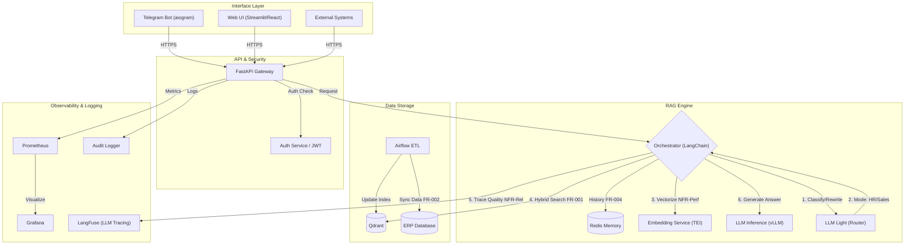

# Тестовое задание: Корпоративная RAG-система для ERP

---

## Часть 1.

### 1. Выбор архитектурного подхода
Для создания корпоративного ассистента с ролевой моделью (HR, Бухгалтер, Продажи) выбран подход **RAG (Retrieval-Augmented Generation)**.

**Обоснование выбора (Почему RAG, а не Fine-Tuning?):**

1.  **Актуальность данных (Data Freshness):**
    *   *RAG:* Позволяет искать по данным, которые обновились минуту назад (например, изменился статус заказа в ERP или вышел новый приказ).
    *   *Fine-Tuning:* Требует переобучения модели для обновления знаний. В динамичной среде ERP модель всегда будет устаревшей.
2.  **Безопасность и доступы (RBAC):**
    *   *RAG:* Позволяет фильтровать документы *до* их попадания в контекст модели. Мы гарантируем, что сотрудник отдела продаж не получит информацию из зарплатных ведомостей HR.
    *   *Fine-Tuning:* Знания "запекаются" в веса модели. Невозможно надежно ограничить модель в выдаче секретной информации конкретному пользователю.
3.  **Отсутствие галлюцинаций:**
    *   *RAG:* Мы можем требовать от модели отвечать *только* на основе найденного контекста и прикладывать ссылки на источники.

### 2. Реализация "Режимов" (Ролей)
Чтобы ассистент работал в разных режимах ("HR", "Бухгалтерия"), в архитектуру внедряется компонент **Semantic Router (Классификатор интентов)**.

**Логика работы:**
1.  **Input:** Пользователь пишет: *"Как оформить отпуск?"*
2.  **Routing:** Легкая LLM (Router) классифицирует запрос -> **Intent: HR**.
3.  **Execution:** Система активирует специфическую ветку (Agent):
    *   Подставляет системный промпт: *"Ты опытный HR-менеджер..."*
    *   Выполняет поиск только по индексу документов `knowledge-base-hr`.
    *   Использует специфические инструменты (например, API календаря отпусков).

---

## Часть 2. Техническая реализация требований RAG для ERP

### 1. Цель и Область действия
Создание интеллектуального ассистента для сотрудников компании.
*   **Цель:** Автоматизация ответов по документации и бизнес-данным ERP.
*   **Стек:** Open Source LLM, RAG-архитектура, On-premise развертывание.
*   **Интерфейсы:** Telegram Bot, Web UI, REST API.

### 2. Анализ требований

Для обеспечения прозрачности решения, каждому требованию присвоен ID.

**Функциональные требования (FR):**
| ID | Требование | Описание |
|:---|:---|:---|
| **FR-001** | Поиск в документации | Поиск по базе знаний (PDF, MD, Confluence). |
| **FR-002** | Ответы по данным | Ответы на основе актуальных данных из ERP. |
| **FR-003** | Мультиязычность | Поддержка RU/EN. |
| **FR-004** | Контекст | Учет истории диалога (Memory). |
| **FR-005** | Цитирование | Ссылки на источники в ответе. |

**Нефункциональные требования (NFR):**
*   **NFR-Perf:** Время ответа < 3 сек (P95).
*   **NFR-Load:** 1000 concurrent users.
*   **NFR-Sec:** Аудит всех запросов, RBAC (права доступа).
*   **NFR-Rel:** Точность ответов > 85%.

---

### 3. Архитектурное решение

#### 3.1. Высокоуровневая архитектура (C4 Level 2)

Схема включает контуры интерфейсов, безопасности, обработки данных и мониторинга.

#### 3.2. Компоненты системы (Matrix of Traceability)

| Компонент | Технология | Связь с требованиями |
|-----------|------------|-----------------------------|
| **API Gateway** | **FastAPI** | **(NFR-Perf)**: Асинхронная обработка запросов (1000 concurrent). **Раздел 2**: Единая точка входа. |
| **Interfaces** | **aiogram, Streamlit** | **Раздел 2**: Реализация Telegram-бота и Веб-интерфейса. |
| **Orchestrator** | **LangChain** | Логика Semantic Router (выбор режима HR/Бухгалтер). **(FR-004/005)**: Память диалога и цитирование. |
| **Vector Store** | **Qdrant** | **(FR-001/002)**: Гибридный поиск по документам. **(NFR-Sec)**: Фильтрация по правам доступа (RBAC). |
| **LLM Light** | **Qwen 2.5 3B** | Используется для маршрутизации (Routing) и Query Expansion. |
| **LLM Core** | **vLLM + Qwen 14B** | **(FR-003)**: Основная генерация ответов. **(NFR-Perf)**: vLLM обеспечивает высокую пропускную способность. |
| **Embedding Service** | **TEI** | **(NFR-Perf)**: Выделенный микросервис для векторизации текста. |
| **Monitoring** | **Prometheus + Grafana** | **(Раздел 6.2)**: Performance Dashboard. |
| **Audit Logging** | **ELK / Loki** | **(NFR-Sec)**: Логирование запросов для службы безопасности. |
| **LLM Tracing** | **LangFuse** | **(NFR-Rel)**: Мониторинг качества (точность, галлюцинации). |
| **ETL Pipeline** | **Apache Airflow** | **(FR-002)**: Регулярная синхронизация данных из ERP. |

---

### 5. Технические требования

#### 5.1. Анализ и выбор моделей

**Заключение по таблице из ТЗ:**
Предложенный стек моделей **функционален**, но имеет **критические риски по ресурсам (VRAM)** и **устаревшие компоненты (Embeddings)**. Ниже приведен детальный анализ и рекомендации по исправлению.

| Компонент | Модель из ТЗ | Анализ (Что хорошо / Что плохо) | Рекомендация по исправлению |
|-----------|--------------|---------------------------------|-----------------------------|
| **Эмбеддинги** | `paraphrase-multilingual-MiniLM-L12-v2` | **Плохо:** Модель устарела (2021 г.). Лимит 512 токенов критичен для документации. Качество русского языка среднее. | Заменить на **`intfloat/multilingual-e5-large`** или **`BAAI/bge-m3`** (до 8192 токенов, SOTA качество). Ресурсов хватит. |
| **LLM (Основная)** | `Qwen2.5-14B-Instruct` | **Критично:** В формате FP16 модель весит ~28 ГБ. **Она не влезет в карту 24 ГБ VRAM** (будет OOM ошибка). | Обязательно использовать **квантование (AWQ/GPTQ Int4)**. Вес упадет до ~10-12 ГБ, качество сохранится, останется место под контекст. |
| **LLM (Легкая)** | `Qwen2.5-3B-Instruct` | **Рискованно:** Запуск на CPU (8 ядер) даст скорость 5-10 токенов/сек. Это ставит под угрозу SLA < 3 сек. | Использовать GPU (даже слабую) или оптимизированный рантайм **llama.cpp** (GGUF формат). |
| **Ранжирование** | `BAAI/bge-reranker-v2-m3` | **Хорошо:** Отличный выбор. Мультиязычная, поддерживает длинный контекст. | Оставить без изменений. |

#### 5.2. Векторная база данных

**Критерии выбора:**
1.  **Hybrid Search (Гибридный поиск):** Обязательное наличие поиска по ключевым словам (BM25) в сочетании с вектором. *Обоснование:* В ERP часто ищут точные совпадения (артикул, ID заказа, фамилия), векторный поиск тут может ошибаться.
2.  **Filtering & Security (RBAC):** Эффективная пре-фильтрация (Pre-filtering) метаданных. *Обоснование:* Разграничение прав доступа. Сотрудник склада не должен находить в поиске зарплатные ведомости.
3.  **Performance:** Latency < 50мс на поиск (P95) при нагрузке.
4.  **Self-hosted:** Возможность развертывания on-premise (Docker/K8s) для безопасности данных.

**Кандидаты:**
*   **Qdrant (Рекомендован):** Написан на Rust, нативно поддерживает Hybrid Search, очень быстрый, удобная фильтрация Payload.
*   **Elasticsearch / OpenSearch:** Стандарт индустрии. Сильный полнотекстовый поиск, но требователен к ресурсам (RAM/Java) и сложнее в настройке векторов.
*   **Milvus:** Подходит для огромных масштабов (миллиарды векторов), но имеет сложную микросервисную архитектуру (overkill для данной задачи).

**Выбор:** **Qdrant**

**Почему:**
1.  **Hybrid Search:** Для ERP важен поиск по точным номерам (BM25) + смыслу (Vector).
2.  **Filtering (RBAC):** Эффективная пре-фильтрация (Pre-filtering) для разграничения прав доступа сотрудников разных отделов.
3.  **Performance:** Rust core обеспечивает низкий latency.

---

### 6. Метрики и Контроль качества

### 6.1. Анализ метрик оценки

| Метрика | Тип | Статус | Комментарий / Решение |
|:---|:---|:---|:---|
| **Recall@k** | Retrieval | ✅ Оставить | Критически важно. Показывает, попадает ли нужный документ в выдачу поиска. |
| **MRR** | Retrieval | ✅ Оставить | Показывает качество ранжирования (насколько высоко правильный ответ). |
| **ROUGE-L / BLEU** | Generation | ❌ **Убрать** | Эти метрики сравнивают текст пословно. Для RAG они бесполезны и вредны, так как LLM может ответить верно, но другими словами. |
| **Perplexity** | Generation | ⚠️ Сомнительно | Показывает уверенность модели, а не фактологическую точность. |
| **RAGAS Metrics** | Generation | ✅ **Добавить** | Использовать подход **LLM-as-a-Judge**:  1. **Faithfulness:** Проверка на галлюцинации (ответ выведен из контекста?). 2. **Answer Relevance:** Релевантность ответа вопросу. |
| **CSAT / Resolution Rate** | Business | ✅ Оставить | Главные метрики успеха для бизнеса. |

### 6.2. Мониторинг
Предлагаемая структура дашбордов верна. Рекомендуется добавить:
*   **Negative Feedback Cluster:** Группировка вопросов, на которые пользователи поставили "дизлайк", для дообучения базы знаний.
*   **Empty Search Rate:** Частота запросов, на которые в базе знаний не нашлось ни одного документа.
*   **Security:** Audit Log (кто, когда, к каким данным обращался).

---

### 7. План реализации

**Ресурсы:** Команда 3 человека (ML Lead, Backend/DevOps, Data Engineer).

**Оценка времени:** 3-4 месяца до полноценного Production.

### Фаза 1: MVP и Инфраструктура (4 недели)
*   **Неделя 1:** Настройка окружения (GPU Server, Docker). Развертывание **vLLM** (Qwen 14B Int4) и **Qdrant**.
*   **Неделя 2:** Разработка ETL пайплайна для загрузки документации (PDF/MD). Чанкинг и индексация.
*   **Неделя 3:** Реализация базового RAG (LangChain): Retrieval -> Generation.
*   **Неделя 4:** Создание Telegram-бота и проведение первого Demo для стейкхолдеров.

### Фаза 2: Качество и Интеграция (4 недели)
*   **Неделя 5:** Внедрение **Hybrid Search** (настройка токенизации для BM25).
*   **Неделя 6:** Подключение **Reranker** модели. Оптимизация промптов (System Prompts).
*   **Неделя 7:** Интеграция с бизнес-данными ERP (структурированные таблицы).
*   **Неделя 8:** Настройка Evaluation пайплайна (RAGAS) и достижение метрики точности > 80%.

### Фаза 3: Продуктизация (4 недели)
*   **Неделя 9:** Реализация API Gateway и Web UI.
*   **Неделя 10:** Внедрение **RBAC** (фильтрация по правам доступа).
*   **Неделя 11:** Оптимизация производительности (Кэширование Redis, Streaming Response). Нагрузочное тестирование.
*   **Неделя 12:** Запуск пилота на группу 50 человек. Сбор обратной связи.

---

## 8. Предложения по развитию (Advanced Scope)

Для решения специфических проблем ERP-систем предлагается включить в Roadmap следующие улучшения:

### 8.1. Text-to-SQL Агент
Векторный поиск плохо справляется с агрегацией данных ("Какая общая сумма заказов за март?").
*   **Решение:** Внедрить классификатор намерений (Router). Если вопрос касается аналитики, передавать его в Text-to-SQL модель, которая генерирует прямой SQL-запрос к базе данных ERP.

### 8.2. Agentic Workflow
Для автоматизации рутины (FR-003) линейного RAG недостаточно.
*   **Решение:** Использовать агентную архитектуру (ReAct / LangGraph). Это позволит системе выполнять действия: "Проверь статус заявки X и, если она просрочена, создай тикет в Service Desk".

### 8.3. Семантическое кэширование
Для гарантии выполнения SLA `< 3 сек` при высокой нагрузке.
*   **Решение:** Использовать **Redis VL** для кэширования ответов. Если новый вопрос семантически похож на предыдущий (расстояние между векторами < 0.1), система отдает готовый ответ из кэша, не запуская тяжелую LLM.
